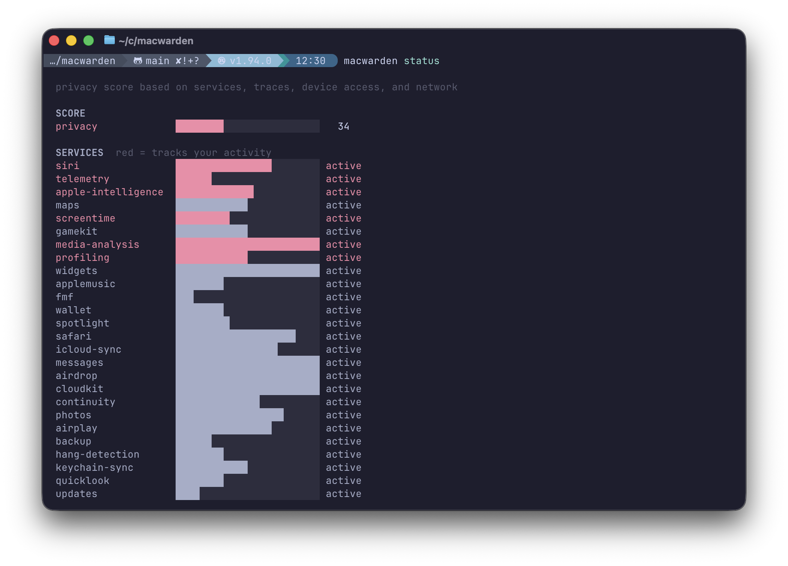
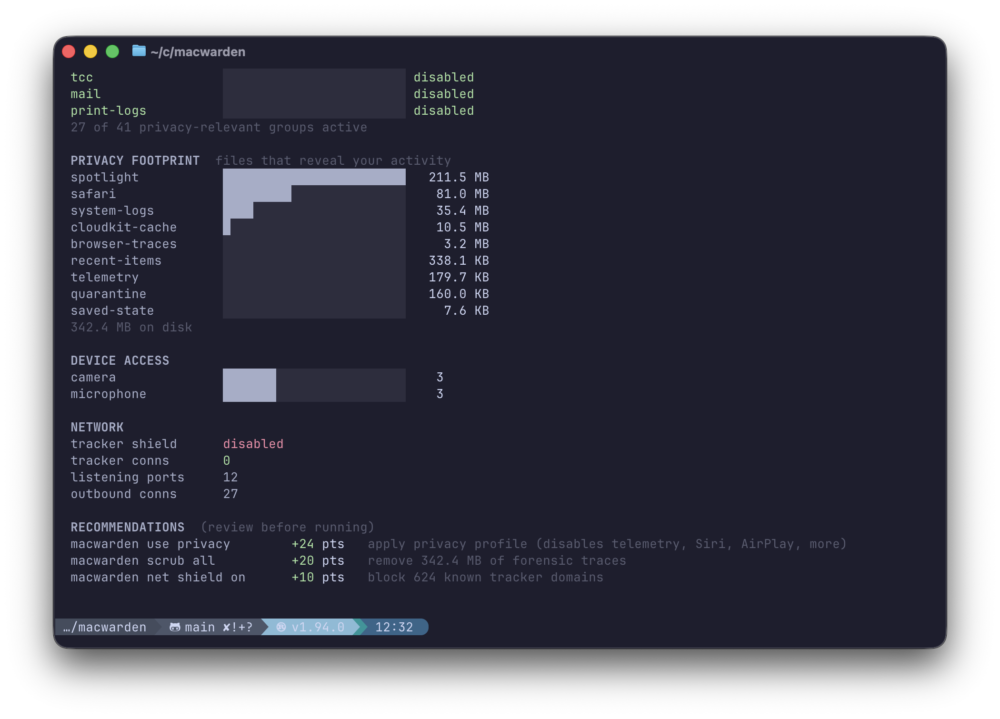

# macwarden (EXPERIMENTAL)

Your Mac runs 500+ silent processes — telemetry, profiling, Siri, Spotlight, iCloud sync. There's no off switch. **macwarden is the off switch.**

<p align="center">
  
</p>

## Your Mac is not yours

A fresh Mac with no apps installed runs over 500 background processes. Most have no controls in System Settings. Here's what they do:

**Spotlight** sends your search queries to Apple, Microsoft Bing, and unnamed third parties — along with your location, the apps you use, and what you click. It extracts thousands of named entities from your browsing and builds topic profiles using three separate algorithms. Enabled by default since 2014.

**Siri** records and sends audio to Apple servers, including accidental activations. A whistleblower revealed contractors listened to intimate conversations, medical details, and business calls. Apple admitted it. Paid $95M to settle in January 2025.

**On-device profiling** — `EntityTagging_Family` reads your contacts, photos, call patterns, and location history to classify every person in your life — mother, father, sister, brother, partner, coworker, child — using 144 input features, updated every 2 hours. `EntityRelevanceModel` cross-references your geohash, WiFi network, and time of day to decide who matters to you right now. Your photos are ranked into tiers called `GoldAssets`, `ShinyGems`, and `RegularGems` by a model that learned what you find beautiful. A nudity scanner runs on every image. 21 ML models run continuously behind coreduetd, suggestd, biomesyncd, and routined. None have an off switch in System Settings.

**Telemetry** — analyticsd, reportingd, and 18 other services report diagnostics, usage patterns, and crash data. Even when every analytics toggle in System Settings is off — Apple still collects, tagging records under internal `OptOut` configs.

**iCloud** — in February 2025, the UK government ordered Apple to backdoor iCloud under the Investigatory Powers Act. Apple complied by removing end-to-end encryption for UK users.

You can't turn most of this off. macOS gives you a few toggles in System Settings. The services keep running.

macwarden discovers all of them, groups them by function, and lets you shut them down — even the ones Apple doesn't expose. It also firewalls your network traffic, inventories every binary on your system, and scores your overall privacy posture. Works with SIP enabled.

## Install

```bash
cargo install --path crates/macwarden
```

Or download the notarized `.dmg` from [Releases](#).

## Lock it down

Disable telemetry, Siri, Spotlight, iCloud sync, Apple Intelligence, profiling, and 90+ other services in one command:

```bash
sudo macwarden use privacy
```

Every action is snapshotted. Undo everything:

```bash
sudo macwarden undo
```

## See what's happening

```bash
macwarden status              # privacy score + full posture dashboard
macwarden                     # list all service groups
macwarden network             # active network connections by service
macwarden devices             # camera and microphone access
```

## Go deeper

Inspect a group — what services it contains, what they do, what ports they use:

```bash
macwarden info siri
macwarden info com.apple.Siri.agent   # inspect a single service
```

Block or allow individual groups:

```bash
sudo macwarden block siri
sudo macwarden block telemetry
sudo macwarden allow siri             # re-enable
```

Exclude specific services from a group block:

```bash
sudo macwarden block continuity --except com.apple.Handoff
```

## Network firewall

Block 624 known tracker domains across advertising, analytics, fingerprinting, and social tracking in one command:

```bash
macwarden net shield              # enable tracker shield
macwarden net scan                # see all connections with firewall verdicts
macwarden net scan --trackers     # show only tracker connections
```

Per-app and per-destination rules:

```bash
macwarden net block --app Spotify --host scdn.co
macwarden net block --host tracker.example.com
macwarden net unblock --app Spotify --host scdn.co
```

Learn rules from live traffic:

```bash
macwarden net learn --duration 5m         # watch and suggest rules
macwarden net learn --duration 5m --apply # write suggested rules to disk
```

9 pre-built rule groups (browser essentials, iCloud, media streaming, etc.), 21 curated app profiles, GeoIP enrichment with country and ASN, LuLu rule import, and external blocklist subscriptions.

```bash
macwarden net explain curl api.example.com  # why would this be allowed/denied?
macwarden net apps --live                   # connections grouped by application
macwarden net apps --expand Chrome          # per-destination verdicts for one app
macwarden net import lulu                   # migrate rules from LuLu firewall
macwarden net groups                        # list rule groups with status
```

## Binary inventory

Discover every binary on your system, hash it, verify its code signature, and check it against a known-bad blocklist:

```bash
macwarden inventory scan              # apps + system binary directories
macwarden inventory scan --all        # full system via Spotlight + system dirs
macwarden inventory scan --lookup     # scan then analyze unanalyzed via openbinary
```

The inventory store persists across scans — openbinary analysis results are preserved even as new binaries appear and old ones are removed.

```bash
macwarden inventory lookup            # batch-analyze all unanalyzed binaries
macwarden inventory lookup --no-upload  # check-only, don't upload unknowns
```

## Binary analysis

Look up any binary on [openbinary](https://openbinary.org) for behavioral analysis — capabilities, frameworks, entitlements:

```bash
macwarden lookup /usr/bin/curl        # hash, lookup, auto-upload if unknown
macwarden lookup                      # test endpoint connectivity
```

<p align="center">
  
</p>

## Scrub forensic traces

Delete privacy footprint — browser history, download logs, window snapshots, caches:

```bash
macwarden scrub all                   # wipe all forensic traces
macwarden scrub safari                # just Safari artifacts
macwarden scrub saved-state           # window snapshots
macwarden scrub quarantine-events-db  # single artifact by name
macwarden scrub --list                # see all 42 artifacts across 12 domains
macwarden scrub --dry-run safari      # preview with sizes before deleting
```

## Stay locked down

Services respawn. macwarden watches for drift and re-enforces:

```bash
sudo macwarden watch              # continuous enforcement
sudo macwarden watch --install    # run as persistent daemon
```

## Commands

```
macwarden status                      privacy score + full posture dashboard
macwarden                             list service groups (default)
macwarden info <target>               inspect a group, service, or profile
macwarden network                     active network connections by service
macwarden devices                     camera and microphone access
macwarden scrub <target>              delete privacy footprint artifacts
macwarden scrub --list                show all scrub targets
macwarden lookup [path]               binary analysis via openbinary
macwarden inventory scan [--all]      discover, hash, and store binaries
macwarden inventory lookup            batch-analyze inventory via openbinary
macwarden net shield                  block 624 known tracker domains
macwarden net scan                    connections with firewall evaluation
macwarden net block --app/--host      quick deny rule
macwarden net learn                   suggest rules from live traffic
macwarden net explain <proc> [host]   explain a firewall decision
macwarden net apps --live             connections grouped by app
macwarden net import lulu             import rules from LuLu firewall

sudo macwarden use <profile>          apply a profile (e.g. privacy)
sudo macwarden block <target>         disable a service or group
sudo macwarden allow <target>         re-enable a service or group
sudo macwarden watch                  continuous enforcement
sudo macwarden undo                   revert last action
```

## How it works

**Services** — macwarden uses `launchctl disable` to persistently prevent services from loading — this works with SIP enabled. For immediate effect, it also runs `bootout` and `kill -9` as needed. Blocked services stay off across reboots. Every destructive action saves a snapshot so you can `undo`.

**Network** — the firewall evaluates every connection against a five-tier rule engine (exact deny, exact allow, glob deny, glob allow, default). 624 tracker domains across 4 categories are blocked by the tracker shield. Essential domains (OCSP, NTP, system updates) are safelisted to prevent self-inflicted breakage. Graylist detection flags abusable Apple-signed binaries (shells, curl, python) that bypass naive code-signing trust.

**Inventory** — every binary is SHA-256 hashed, code-signature verified, and checked against a known-bad hash blocklist. The persistent store at `~/.macwarden/inventory/` accumulates openbinary behavioral analysis across scans. Sealed system volume binaries skip code signing checks — the OS guarantees their integrity.

**Scoring** — a 0-100 privacy score aggregates across 4 dimensions: services (how many are disabled), traces (forensic artifacts on disk), devices (camera/mic grants), and network (tracker connections). Each score includes actionable commands with estimated point gains.

The catalog covers 255 macOS services organized into 48 groups with safety tiers (recommended, optional, keep). 42 privacy artifacts across 12 domains are tracked for forensic cleanup. 16 critical services (WindowServer, launchd, securityd) are hardcoded as undisableable.

Recovery: boot into Recovery Mode → Terminal → delete `/private/var/db/com.apple.xpc.launchd/disabled.plist`.

See [themacfiles](https://github.com/aejimmi/themacfiles) for the full research on macOS data collection and on-device ML models.

## Roadmap

- Additional profiles — paranoid, developer, minimal
- Scheduled scrub — automatic daily/weekly footprint cleanup
- Browser artifact depth — cookie counts, domain counts per site
- Graphical interface
